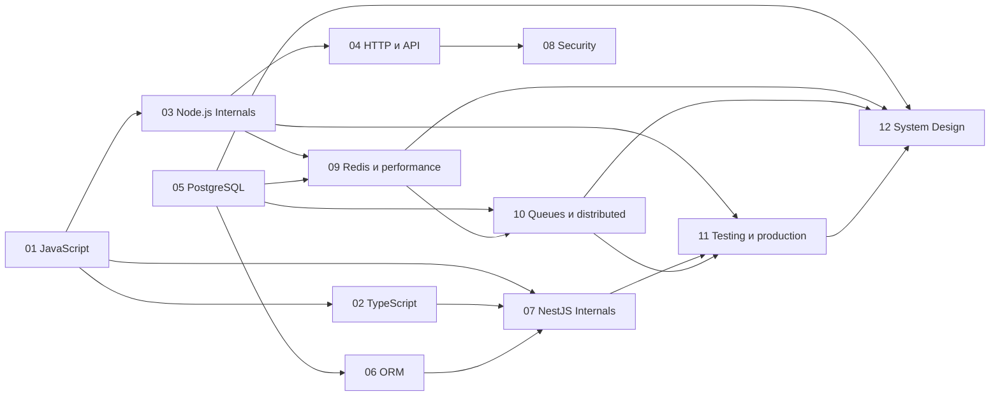

# Backend Developer (Node.js / NestJS): подготовка к собеседованиям Middle → Senior

Теоретический курс для разработчика, который **уже писал backend** и хочет систематизировать знания, разобраться во внутренних механизмах и подготовиться к техническим интервью на позиции Middle, Strong Middle и Senior.

Это не курс с нуля. Здесь нет пошаговых туториалов, настройки окружения, домашних заданий и проектов. Код, SQL и схемы появляются только там, где без них не объяснить механизм.

> **Статус:** структура курса заморожена: 12 блоков, 75 уроков. Планы блоков лежат в `course/NN-block/README.md`, написанные уроки отмечены ссылкой в таблице своего блока. Эталонный урок [1.1](./course/01-javascript/01-execution-context-scope-this/) написан и ожидает проверки. После его принятия — блок 01 целиком и его аудит до перехода к блоку 02.

---

## Философия

Курс отвечает не на вопрос «что такое X», а на вопросы: **как X устроен внутри**, **почему он устроен именно так**, **что из этого следует для backend**, **когда X не подходит и чем его заменить**, **какие ошибки делают на практике**.

Три правила:

1. **Различать источник утверждения.** Спецификация языка, поведение runtime, поведение библиотеки и архитектурная рекомендация — четыре разных уровня гарантий. В тексте они помечаются:

   | Метка | Что означает |
   |---|---|
   | `[spec]` | гарантировано стандартом или формальной спецификацией (ECMAScript, RFC, SQL standard) |
   | `[runtime]` | поведение конкретной реализации (V8, Node.js, libuv, PostgreSQL, Redis), включая её документированные гарантии; указывается версия, потому что поведение может меняться |
   | `[lib]` | поведение библиотеки или фреймворка (NestJS, Prisma, TypeORM, BullMQ, ioredis) |
   | `[arch]` | архитектурная рекомендация, то есть компромисс, а не закон |

2. **Если поведение зависит от версии или конфигурации, это написано явно.** Изменчивые детали сверяются с официальной документацией на момент написания урока.
3. **Ни одна тема не живёт изолированно.** У каждого урока есть prerequisites и связи вперёд.

### Уровни уроков

| Уровень | Что это |
|---|---|
| 🟢 **Фундамент** | то, что спрашивают уже на Middle; разбирается быстро, с акцентом на граничные случаи |
| 🟡 **Углублённый** | механизм и причины; основной уровень для Strong Middle |
| 🔴 **Senior** | внутреннее устройство, trade-offs, архитектурные последствия, принятие решений |

Уровень урока обозначает глубину темы. **Вопросы интервью в каждом уроке есть всех трёх уровней**: даже у 🟢-темы бывают Senior-вопросы.

---

## Как устроен урок

```
course/NN-block/XX-topic/
├── README.md      — контракт урока: уровень, prerequisites, ключевая формулировка, границы, связи, среда проверки примеров
├── theory.md      — определения → механизм → сценарий → причины и следствия → альтернативы → ошибки → Senior-нюансы → источники
└── interview.md   — конспект → вопросы Middle / Strong Middle / Senior → «предскажи результат» → чек-лист → поверхностный против сильного ответа
```

Эталон формата — [урок 1.1](./course/01-javascript/01-execution-context-scope-this/). В `theory.md` каждый механизм разбирается одинаково: что это → как работает по шагам → что гарантирует спецификация → что зависит от среды, режима или версии → пример с разбором → типичная ошибка и диагностика → ссылка на вопрос интервью. Раздел источников содержит только официальные материалы, открытые при написании, с датой проверки. Каждый пример с выводом запускается, а версия среды указывается в README урока.

**Обязательная часть и углубление.** `theory.md` делится на обязательную часть и раздел «Углубление для Strong Middle / Senior». Туда уходят детали реализации движка, исторические исключения языка, редкие граничные случаи и внутренности библиотек; из обязательной части на них стоят короткие ссылки. Объём урока определяется темой: эталон задаёт строгость и структуру, а не число строк.

**Ответы скрыты.** В `interview.md` ответы на вопросы и фрагменты кода спрятаны в раскрывающиеся блоки `<details>`. Читатель сначала отвечает сам — результат **и** механизм, — потом сверяется.

**Сценарий** в `theory.md` показывает механизм в действии: что происходит по шагам при реальном запросе или сбое. Например, как запрос проходит через pipeline NestJS или что видят две конкурентные транзакции.

Каждый вопрос в `interview.md` разобран по одной схеме: **тезис** (с чего начать ответ на собеседовании) → **подробно** → **ограничения и зависимость от версий** → **уточняющие вопросы**. У ключевых вопросов это цепочка из 2–4 follow-up вопросов с короткими ответами, как их задаёт интервьюер. У простых вопросов один.

В README каждого блока есть раздел **«Заблуждения, которые нужно развенчать»**: неверные, но популярные ответы, которые урок обязан разобрать в секции ошибок.

**Папка урока появляется только вместе с текстом.** Если папки нет, урок ещё не написан и его план смотреть в `README.md` блока.

### Критерий готовности урока

Урок считается написанным, только если выполнены все пункты:

- [ ] Механизм объяснён последовательно, по шагам, а не только определён.
- [ ] Разобран хотя бы один реальный сценарий: запрос, конкурентный доступ или сбой.
- [ ] Ограничения и зависимость от версий указаны явно, утверждения помечены `[spec]` / `[runtime]` / `[lib]` / `[arch]`. Утверждение с меткой `[runtime]` или `[lib]` проверено по документации или исходникам **той версии, которая указана**, а не просто снабжено номером версии.
- [ ] Если у темы есть альтернативы, в `interview.md` есть задача на выбор решения: условия → варианты → выбор → при каких условиях выбор перестаёт быть верным. Например: блокировка или optimistic concurrency, очередь или синхронный вызов, кешировать или нет.
- [ ] Разобраны граничные случаи, а не только основной путь. Например, для транзакций: write skew, блокировки и retry после serialization failure.
- [ ] Развенчаны все заблуждения, которые README блока привязывает к этому уроку.
- [ ] Есть вопросы с эталонными ответами уровней Middle, Strong Middle и Senior.
- [ ] У ключевых вопросов есть цепочка уточняющих вопросов интервьюера с ответами.
- [ ] Нет фактических ошибок и универсальных рекомендаций без условий применимости.
- [ ] Каждый пример с выводом запущен, вывод совпадает с текстом; есть фрагменты «предскажи результат», включая сложные случаи.
- [ ] Существенные утверждения подкреплены ссылками на официальные источники, открытыми при написании урока.

Объём урока определяется механизмом, а не числом абзацев. Цель — не энциклопедия, а умение объяснить, предсказать поведение и защитить решение.

После завершения каждого блока проводится технический аудит всех его уроков по этому чек-листу.

**Главный тест урока:** если после него нельзя предсказать поведение программы, объяснить причину сбоя или аргументированно выбрать решение, урок дорабатывается, сколько бы в нём ни было текста.

---

## Карта курса

| Блок | Тема | Уроков | 🟢 / 🟡 / 🔴 |
|---|---|---|---|
| [01](./course/01-javascript/) | JavaScript для backend | 6 | 2 / 4 / 0 |
| [02](./course/02-typescript/) | TypeScript | 5 | 2 / 2 / 1 |
| [03](./course/03-nodejs-internals/) | Node.js Internals | 7 | 1 / 4 / 2 |
| [04](./course/04-http-networking-api/) | HTTP, сети и API design | 6 | 3 / 2 / 1 |
| [05](./course/05-postgresql/) | PostgreSQL | 9 | 2 / 2 / 5 |
| [06](./course/06-orm/) | ORM | 4 | 0 / 3 / 1 |
| [07](./course/07-nestjs-internals/) | NestJS Internals | 7 | 2 / 3 / 2 |
| [08](./course/08-security/) | Security | 6 | 1 / 3 / 2 |
| [09](./course/09-redis-performance/) | Redis и performance | 5 | 1 / 2 / 2 |
| [10](./course/10-queues-distributed/) | Queues и distributed systems | 6 | 1 / 2 / 3 |
| [11](./course/11-testing-production/) | Testing и production | 6 | 1 / 3 / 2 |
| [12](./course/12-system-design/) | Senior System Design | 8 | 1 / 1 / 6 |
| | **Итого** | **75** | **17 / 31 / 27** |

### Три слоя курса

- **Фундамент** (блоки 01, 02, 04, начало 05): язык, типы, HTTP, SQL. Без них остальные блоки превращаются в заучивание рецептов.
- **Углублённый слой** (блоки 03, 05, 06, 07, 08, 09): как устроены Node.js, PostgreSQL, ORM, NestJS, Redis; безопасность.
- **Senior-слой** (блоки 10, 11, 12 и 🔴-уроки остальных блоков): распределённые системы, production, архитектура и system design.

### Зависимости между блоками



Рекомендуемый порядок совпадает с нумерацией 01 → 12. Блоки 04 и 05 не зависят друг от друга, их можно проходить параллельно.

### Сквозные темы

Некоторые вопросы интервью не принадлежат одному блоку: их задают на стыке PostgreSQL, ORM, Redis и очередей. Такие темы разбираются в нескольких уроках с нарастающей глубиной:

| Тема | Где разбирается |
|---|---|
| Конкурентность и race conditions | 1.4 → 5.5 → 5.6 → 6.4 → 9.4 → 10.6 → 12.7 |
| Идемпотентность и повторы | 4.3 → 4.4 → 10.1 → 10.5 → 12.7 |
| Обработка ошибок | 1.4 → 3.7 → 4.3 → 7.5 → 10.5 → 11.5 |
| Конфигурация, секреты, миграции | 6.4 → 7.2 → 8.6 → 11.3 |
| Безопасность | 4.1 → 4.5 → 8.1–8.6 → 11.3 |
| Тестирование конкурентности и отказов | 11.1 (опирается на 5.5, 10.5, 11.5) |
| Наблюдаемость и диагностика | 3.2 → 3.5 → 3.7 → 9.5 → 11.4 → 11.6 |
| Оценка нагрузки и пропускной способности | 5.9 → 9.5 → весь блок 12 |
| Таймаут и повтор (сквозной сценарий ниже) | 1.4 → 4.4 → 4.6 → 5.5 → 7.5 → 10.5 → 12.7 |

**Сквозной сценарий «таймаут и повтор».** Клиент отправил запрос. Сервер начал транзакцию или вызвал внешнюю систему. Клиент получил таймаут, хотя операция могла завершиться. Клиент повторил запрос. Как система определит, можно ли повторить операцию, и как избежит двойного эффекта? Каждый урок из цепочки разбирает свою часть этого сценария:
- отмена и таймауты в коде (1.4);
- Idempotency-Key (4.4);
- таймауты между клиентом, балансировщиком и Node.js (4.6);
- транзакция и её повтор (5.5);
- ответ об ошибке (7.5);
- повторная доставка сообщения (10.5);
- сквозная идемпотентность (12.7).

Вместе они дают полный ответ.

Курс не заменяет документацию по каждому инструменту и не готовит к алгоритмической секции и live coding. Его задача — модель системы, с которой можно рассуждать о незнакомой ситуации.

---

## Команды управления курсом

| Команда | Что происходит |
|---|---|
| «Далее» | следующий урок |
| «Подробнее: [тема]» | углублённая секция добавляется в `theory.md` текущего урока |
| «Вопросы по теме» | дополнительные вопросы с ответами добавляются в `interview.md` |
| «Шпаргалка» | `cheatsheet.md` в папке урока или блока |
| «Собеседование» | интерактивный режим в чате: один вопрос, мой ответ, оценка и разбор ошибок |
