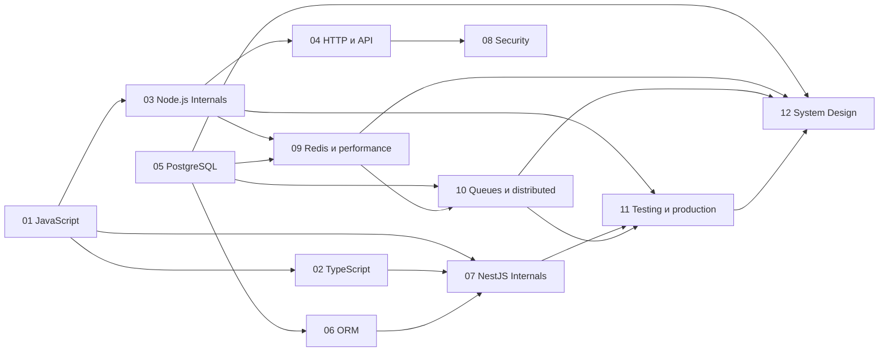

# Backend Developer (Node.js / NestJS): подготовка к собеседованиям Middle → Senior

Теоретический курс для разработчика, который **уже писал backend** и хочет систематизировать знания, разобраться во внутренних механизмах и подготовиться к техническим интервью на позиции Middle, Strong Middle и Senior.

Это не курс с нуля. Здесь нет пошаговых туториалов, настройки окружения, домашних заданий и проектов. Код, SQL и схемы появляются только там, где без них не объяснить механизм.

> **Статус:** карта курса зафиксирована, планы всех 12 блоков лежат в `course/NN-block/README.md`. Написанные уроки отмечены ссылкой в таблице своего блока.

---

## Философия

Курс отвечает не на вопрос «что такое X», а на вопросы: **как X устроен внутри**, **почему он устроен именно так**, **что из этого следует для backend**, **когда X не подходит и чем его заменить**, **какие ошибки делают на практике**.

Три правила:

1. **Различать источник утверждения.** Спецификация языка, поведение runtime, поведение библиотеки и архитектурная рекомендация — четыре разных уровня гарантий. В тексте они помечаются:

   | Метка | Что означает |
   |---|---|
   | `[spec]` | гарантировано стандартом или формальной спецификацией (ECMAScript, RFC, SQL standard) |
   | `[runtime]` | поведение конкретной реализации (V8, Node.js, libuv, PostgreSQL, Redis), включая её документированные гарантии; указывается версия, потому что поведение может меняться |
   | `[lib]` | поведение библиотеки или фреймворка (NestJS, Prisma, TypeORM, BullMQ, ioredis) |
   | `[arch]` | архитектурная рекомендация, то есть компромисс, а не закон |

2. **Если поведение зависит от версии или конфигурации, это написано явно.** Изменчивые детали сверяются с официальной документацией на момент написания урока.
3. **Ни одна тема не живёт изолированно.** У каждого урока есть prerequisites и связи вперёд.

### Уровни уроков

| Уровень | Что это |
|---|---|
| 🟢 **Фундамент** | то, что спрашивают уже на Middle; разбирается быстро, с акцентом на граничные случаи |
| 🟡 **Углублённый** | механизм и причины; основной уровень для Strong Middle |
| 🔴 **Senior** | внутреннее устройство, trade-offs, архитектурные последствия, принятие решений |

Уровень урока обозначает глубину темы. **Вопросы интервью в каждом уроке есть всех трёх уровней**: даже у 🟢-темы бывают Senior-вопросы.

---

## Как устроен урок

```
course/NN-block/XX-topic/
├── README.md      — контракт урока: уровень, prerequisites, ключевая формулировка, границы, связи
├── theory.md      — определения → механизм → сценарий → причины и следствия → альтернативы → ошибки → Senior-нюансы
└── interview.md   — вопросы Middle / Strong Middle / Senior с эталонными ответами, резюме, конспект
```

**Сценарий** в `theory.md` показывает механизм в действии: что происходит по шагам при реальном запросе или сбое. Например, как запрос проходит через pipeline NestJS или что видят две конкурентные транзакции.

Каждый вопрос в `interview.md` разобран по одной схеме: **тезис** (с чего начать ответ на собеседовании) → **подробно** → **ограничения и зависимость от версий** → **уточняющие вопросы**. У ключевых вопросов это цепочка из 2–4 follow-up вопросов с короткими ответами, как их задаёт интервьюер. У простых вопросов один.

В README каждого блока есть раздел **«Заблуждения, которые нужно развенчать»**: неверные, но популярные ответы, которые урок обязан разобрать в секции ошибок.

**Папка урока появляется только вместе с текстом.** Если папки нет, урок ещё не написан и его план смотреть в `README.md` блока.

---

## Карта курса

| Блок | Тема | Уроков | 🟢 / 🟡 / 🔴 |
|---|---|---|---|
| [01](./course/01-javascript/) | JavaScript для backend | 6 | 2 / 4 / 0 |
| [02](./course/02-typescript/) | TypeScript | 5 | 2 / 2 / 1 |
| [03](./course/03-nodejs-internals/) | Node.js Internals | 7 | 1 / 4 / 2 |
| [04](./course/04-http-networking-api/) | HTTP, сети и API design | 6 | 3 / 2 / 1 |
| [05](./course/05-postgresql/) | PostgreSQL | 9 | 2 / 2 / 5 |
| [06](./course/06-orm/) | ORM | 4 | 0 / 3 / 1 |
| [07](./course/07-nestjs-internals/) | NestJS Internals | 7 | 2 / 3 / 2 |
| [08](./course/08-security/) | Security | 6 | 1 / 3 / 2 |
| [09](./course/09-redis-performance/) | Redis и performance | 5 | 1 / 2 / 2 |
| [10](./course/10-queues-distributed/) | Queues и distributed systems | 6 | 1 / 2 / 3 |
| [11](./course/11-testing-production/) | Testing и production | 6 | 1 / 3 / 2 |
| [12](./course/12-system-design/) | Senior System Design | 8 | 1 / 1 / 6 |
| | **Итого** | **75** | **17 / 31 / 27** |

### Три слоя курса

- **Фундамент** (блоки 01, 02, 04, начало 05): язык, типы, HTTP, SQL. Без них остальные блоки превращаются в заучивание рецептов.
- **Углублённый слой** (блоки 03, 05, 06, 07, 08, 09): как устроены Node.js, PostgreSQL, ORM, NestJS, Redis; безопасность.
- **Senior-слой** (блоки 10, 11, 12 и 🔴-уроки остальных блоков): распределённые системы, production, архитектура и system design.

### Зависимости между блоками



Рекомендуемый порядок совпадает с нумерацией 01 → 12. Блоки 04 и 05 не зависят друг от друга, их можно проходить параллельно.

---

## Команды управления курсом

| Команда | Что происходит |
|---|---|
| «Далее» | следующий урок |
| «Подробнее: [тема]» | углублённая секция добавляется в `theory.md` текущего урока |
| «Вопросы по теме» | дополнительные вопросы с ответами добавляются в `interview.md` |
| «Шпаргалка» | `cheatsheet.md` в папке урока или блока |
| «Собеседование» | интерактивный режим в чате: один вопрос, мой ответ, оценка и разбор ошибок |
